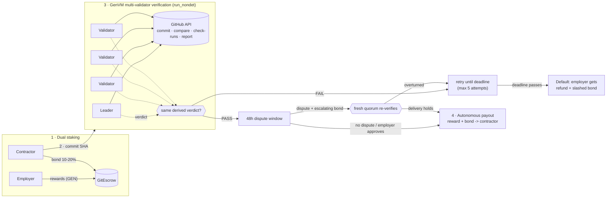

# GitEscrow

**Autonomous, code-verifiable milestone escrow on [GenLayer](https://genlayer.com).**

An employer locks milestone rewards in GEN. A contractor stakes a 10-20% performance bond. When the contractor submits a GitHub commit, a quorum of GenVM validators **independently** inspects it - does the commit exist, is it on the target branch, is CI green, how many tests pass, what is the branch coverage, are there critical findings - and the contract pays out, or doesn't, based on that verdict. No multisig, no arbiter, no "client went silent".

```
contracts/git_escrow.py   the intelligent contract (GenVM, Python)
tests/                    93 direct-mode pytest cases (deposit math, attested CI, resubmit window, external faults, disputes, validator votes)
frontend/                 Next.js + Tailwind dashboard (live against Studio Next)
scripts/                  deploy.py, verify_live.py, simulate_dispute.py
deployments/              recorded Studio Next deployment
```

---

## Architecture



```
 Employer ──reward──┐                                         ┌── PASS ──► 48h window ──► RELEASE
                    ├─► [ GitEscrow ] ◄─commit SHA─ Contractor│                  │ dispute (1x,2x,4x bond)
 Contractor ──bond──┘        │                                │                  ▼
                             ▼                                │          fresh quorum re-check
              ┌─────────────────────────────┐                 │         holds ──► RELEASE (bond -> contractor)
              │ GenVM validators (5)        │─────────────────┤         fails ──► reopen, bond refunded
              │ each fetches GitHub itself  │                 │
              │ leader proposes, rest verify│                 └── FAIL ──► retry … deadline ──► DEFAULT
              └─────────────────────────────┘                                      employer: refund + slashed bond
```

### What validators check (`evaluate_milestone_delivery`)

Every check is a deterministic function of **immutable data bound to the commit SHA** plus the live availability of the repository, so independent validators converge on the same answer. No LLM sits in the loop, which means nothing the contractor writes can ever be interpreted as an instruction.

The repository is bound by its **numeric GitHub id** when the contractor accepts (a consensus round resolves `owner/repo` to an id, following 301 redirects). Every later call goes through `/repositories/{id}`, so a rename or transfer never breaks evaluation.

| # | Check | Source | Failure code |
|---|-------|--------|--------------|
| 0 | Repository reachable (not deleted, private or blocked) | `GET /repositories/{id}` | `repo_unavailable` -> **frozen**, never slashed |
| 1 | Commit exists, payload belongs to this repository | `GET /repositories/{id}/commits/{sha}` (`sha`, `url`, `html_url` must match the repository's current `full_name`) | `commit_not_found`, `spoofed_payload` |
| 2 | Commit is in the target branch's history | `GET .../compare/{branch}...{sha}` -> `identical` or `behind` | `commit_not_on_branch` |
| 3 | **Attested CI**: the check-run with the milestone's exact `check_name`, created by the exact `app_id` (default `15368` = GitHub Actions), completed with `success`; newest re-run wins | `GET .../commits/{sha}/check-runs` | `ci_attestation_missing`, `ci_pending`, `ci_failed` |
| 4 | Passing tests >= minimum, zero failing | parsed from **that check-run's output** (`120 passed`, `0 failed`) | `tests_below_minimum`, `tests_failing` |
| 5 | Branch coverage >= minimum | same check-run output (`Branch coverage: 91.5%`) | `coverage_below_minimum` |
| 6 | Zero critical lint / vulnerability findings (unknown counts as **not clean**) | same check-run output (`Critical issues: 0`) | `critical_findings` |
| 7 | Optional `.gitescrow/report.json` must **strictly match** the check-run | `raw.githubusercontent.com/{repo}/{sha}/.gitescrow/report.json` | `SPOOFED_REPORT_PAYLOAD` |

A contractor-committed `report.json` can **never** substitute for, or improve on, the CI evidence: if it is present it may only corroborate. Any claimed metric (tests, failures, coverage, critical findings) that differs from the check-run, a missing check-run behind a populated report, or a report naming another commit or repository fails the delivery with `SPOOFED_REPORT_PAYLOAD`. Check-runs from other apps or with other names are ignored entirely. Example of the attested check-run summary the parser reads:

```
120 passed, 0 failed. Branch coverage: 91.5%. Critical issues: 0
```

The validator function re-collects the evidence itself and requires the leader's `passed`, `failures`, repository availability, test count, coverage, CI state and report-mismatch flag to match exactly. A leader that forges a PASS, inflates one number, hides a report mismatch or fakes a repository outage is voted down and the round rotates. Errors are classified (`[EXPECTED]`, `[EXTERNAL]`, `[TRANSIENT]`) so rate limits, 5xx and unresolved 301s never convert into a verdict or a penalty.

**Attempt conservation.** A delivery attempt is consumed only by a real verdict. Transient faults revert (nothing consumed). A verdict that is purely `ci_pending` costs a free *CI poll* (up to 20 per milestone, then it counts). An unreachable repository freezes the milestone and costs nothing.

### Milestone state machine

```
PENDING ──evaluate: PASS──► VERIFIED ──settle (after 48h) / approve (employer)──► RELEASED
   │  ▲                        │
   │  └─ dispute OVERTURNED ───┤  deadline := max(deadline, now + 72h), attempts reset,
   │     (resubmit window)     │  claim_default blocked until the new deadline passes
   │                           └─ dispute UPHELD ──► RELEASED (disputer's bond -> contractor)
   │
   ├── deadline + resubmit grace passed, repo reachable, claim_default ──► DEFAULTED (refund + slashed bond)
   │
   └── repo deleted / private / unreachable (claim_default or evaluate) ──► FROZEN_EXTERNAL_FAULT
            ├─ contractor re-submits once the repo answers ──► PENDING (deadline >= now + 72h)
            └─ cancel_fault_free (both consent, or 7 days + repo still gone)
                   ──► CANCELLED_FAULT_FREE: employer refunded, contractor bond returned 100% intact

(OPEN escrow, employer cancel ──► CANCELLED)
```

### Contract surface

| Method | Who | What |
|---|---|---|
| `create_escrow(contractor, repo, branch, title, bond_bps, milestones_json)` *payable* | employer | deposits `sum(rewards)`; 1-10 milestones, bond 1000-2000 bps |
| `accept_escrow(id)` *payable* | contractor | posts `sum(bonds)`; a consensus round binds the repository's numeric id |
| `cancel_escrow(id)` | employer | refund while the contractor has not bonded |
| `evaluate_milestone_delivery(milestone, sha)` | contractor | **consensus verification**; records the report on-chain |
| `settle_milestone(id)` | anyone | release after the 48h window |
| `approve_milestone(id)` | employer | waive the window, release now |
| `file_dispute(id, reason)` *payable* | employer | escalating bond + non-refundable 3% fee; fresh quorum re-verification; overturn grants a 72h resubmit window |
| `claim_default(id)` | anyone | after deadline **and** resubmit grace: probes the repo, then refund + slashed bond to the employer (or freezes if the repo is unreachable) |
| `cancel_fault_free(id)` | employer / contractor | neutral exit for a frozen milestone: employer refunded, bond returned intact |
| `get_escrow`, `get_milestone`, `list_escrows`, `get_stats`, `get_solvency`, `quote_dispute_bond`, `quote_dispute_fee`, `get_strikes` | views | |

---

## Game theory & solvency

Notation: reward `R`, bond `b·R` with `b ∈ [10%, 20%]`, contractor's cost of doing the work `c`. The bonding table and the repository-trust analysis are in *Game Theory, Repo Trust Trilemma & Known Limitations* below.

### Slashing conditions

* **Default** - milestone still `PENDING` after its deadline *and* any resubmit grace window, **and** a consensus probe confirms the repository is reachable: 100% of that milestone's bond goes to the employer together with the refunded reward. Callable by anyone.
* A **failed verification is not slashing**. A rejected delivery costs only an attempt (max 5); the contractor can fix and resubmit until the deadline.
* **Verified milestones cannot be defaulted**, even after the deadline: the contractor delivered in time.
* **External faults are never slashing.** A deleted, private or blocked repository freezes the milestone instead (see below).

### Escalating dispute bonds and the non-refundable fee (anti-griefing)

The employer has no discretionary veto - the only way to contest a verified delivery is `file_dispute` inside the 48h window, and it costs two things:

```
bond = max(0.1 GEN, 1% of reward) × 2^(disputes_on_this_milestone + min(strikes, 4))   (refundable if the delivery is overturned)
fee  = max(0.02 GEN, 3% of reward)                                                       (never refunded; held by the contract for good)
```

| Dispute # on a 100 GEN milestone | Bond | Fee | Total paid |
|---|---|---|---|
| 1st | 1 GEN | 3 GEN | 4 GEN |
| 2nd | 2 GEN | 3 GEN | 5 GEN |
| 3rd | 4 GEN (no 4th: hard cap of 3) | 3 GEN | 7 GEN |
| 1st, by an address with 1 lost dispute | 2 GEN | 3 GEN | 5 GEN |
| 1st, by an address with 4+ lost disputes | 16 GEN | 3 GEN | 19 GEN |

* A dispute is resolved **in the same transaction** by a fresh quorum re-verification of the same commit, so it cannot freeze funds - the worst-case delay is one consensus round, not a time lock.
* **Upheld delivery** (the dispute was frivolous): the bond is forfeited *to the contractor* as compensation, the fee is retained, and the milestone releases immediately. The disputer earns a strike that raises every future bond for that address.
* **Overturned delivery** (e.g. history force-pushed after verification): the bond is refunded, the **fee is not**, and the milestone returns to `PENDING` with `deadline = max(deadline, now + 72h)` and a fresh attempt budget. `claim_default` is blocked until that window has passed, so an employer cannot disprove a delivery after the deadline and then slash the bond before the contractor can react.
* A dispute **cannot be decided** while the repository is unreachable or the attested check-run is re-running (`ci_pending`) - the employer cannot win by deleting the repo or re-triggering CI.

The fee makes a zero-cost harassment dispute impossible: every dispute burns at least 3% of the milestone regardless of outcome, the bond ladder bounds spam on one milestone, and strikes raise the price for repeat offenders.

### Solvency invariant

Every wei is accounted for in exactly one of three buckets, and `get_solvency()` exposes the check on-chain:

```
total_in  ==  total_paid_out  +  liabilities  +  fees_retained
liabilities = Σ over PENDING / VERIFIED / FROZEN milestones of (reward + bond if the escrow is ACTIVE)
```

| Transition | In | Out | Liabilities |
|---|---|---|---|
| create_escrow | +ΣR | | +ΣR |
| accept_escrow | +Σb·R | | +Σb·R |
| release | | R + b·R | −(R + b·R) |
| claim_default | | R + b·R (employer) | −(R + b·R) |
| cancel_escrow | | ΣR | −ΣR |
| cancel_fault_free | | R (employer) + b·R (contractor) | −(R + b·R) |
| file_dispute (upheld) | +bond +fee | R + b·R + bond | −(R + b·R), fees +fee |
| file_dispute (overturned) | +bond +fee | bond | fees +fee |

State is updated *before* any transfer is queued (checks-effects-interactions), and the test-suite asserts the invariant after every settlement path.

## Game Theory, Repo Trust Trilemma & Known Limitations

### The Repository Trilemma

Someone must control the repository, and whoever does can influence the evidence. The three options trade off differently:

| Repository owner | Failure mode | What GitEscrow does about it |
|---|---|---|
| **Employer-owned** (contractor delivers via PR) | The employer can refuse to merge, delete the repo, or make it private to turn a good delivery into a "default" and harvest the bond | Delivery is judged against the **commit**, not the merge: a commit on the target branch with a passing attested check-run is enough. If the repo vanishes, the milestone **freezes** (`FROZEN_EXTERNAL_FAULT`) instead of defaulting, and `claim_default` refuses to slash while the repo is unreachable. |
| **Contractor-owned** | The contractor controls code, workflow and report, so they can forge the evidence, or delete the repo to dodge a slash | Evidence is bound to a **named check-run from a pinned GitHub App id**; a committed `report.json` can only corroborate it (any mismatch is `SPOOFED_REPORT_PAYLOAD`). Deletion yields the same neutral freeze, so it earns the contractor a free exit, never the employer's money. |
| **Neutral third party** (org both sides trust) | Needs a third party; fully removes the incentive to tamper | Recommended whenever the stakes justify it. |

GitEscrow therefore does not claim to remove the need for repo trust. It removes the **profitable** abuses: a party that destroys the evidence cannot slash the other side, and a party that fabricates evidence cannot beat an attested check-run. The residual risk is on the CI side: if the contractor also controls the *workflow* that produces the attested check-run (contractor-owned repo, `app_id` = GitHub Actions), they can make that workflow print flattering numbers. For that case use an employer-owned repo with a required workflow the contractor cannot edit, or pin a third-party GitHub App (`app_id`) whose output the contractor cannot influence.

**Neutral fault-free cancellation.** Deleting, privatising or blocking the repository freezes the milestone. The contractor can revive it by submitting once the repo answers (the deadline is extended to at least `now + 72h`). Otherwise either party may `cancel_fault_free`: immediately if both consent, or after 7 days if a fresh quorum round still finds the repo unreachable. The employer's deposit is refunded and the contractor's bond is returned 100% intact; nobody is slashed and nobody is paid.

### Bonding dynamics and slashing

| Contractor action | Contractor payoff | Employer payoff |
|---|---|---|
| Delivers valid code in time | `R − c` (bond returned) | the deliverable |
| Ghosts / misses the deadline (repo reachable) | `−c_sunk − b·R` | `R + b·R` (full refund **plus** slashed bond) |
| Submits junk repeatedly | nothing; capped at 5 attempts, then default | unaffected |
| Deletes the repo to dodge the slash | bond returned, no reward (neutral exit) | deposit refunded, no deliverable |

Delivering is a dominant strategy whenever `R > c`: ghosting costs the bond, and the neutral-exit route only returns the contractor to where they started. The documented weakness is exactly that last row - on a contractor-owned repo a bad-faith contractor can buy a free exit by deleting it. If that matters, own the repo on the employer side or use a neutral org.

### Mutable off-chain state and timing attacks

Branch heads, check-run states and repository visibility are **mutable off-chain**: a branch can be force-pushed after verification, a check-run can be re-run, a repo can disappear. The defences are structural rather than clock-based:

* **72-hour dispute-resubmit window.** If a dispute overturns a delivery, `deadline = max(deadline, now + 72h)` and attempts reset, and `claim_default` stays blocked until the new deadline passes. An employer who waits for the original deadline to expire, force-pushes, disputes, and then tries to harvest the bond gets nothing: the contractor has three full days to resubmit.
* **Non-refundable arbitration fee** (3%, floor 0.02 GEN) on every dispute, on top of the escalating refundable bond. A dispute that is cheap to file is a free option on the contractor's money; with the fee it is a guaranteed loss unless the delivery was genuinely invalidated.
* **Re-run attacks.** A dispute is refused while the attested check-run is `pending` (re-triggering CI cannot win it) and while the repository is unreachable (hiding the repo cannot win it).
* **Flaky re-runs.** If a re-run of the same check fails and the quorum agrees, the delivery is overturned; the contractor loses nothing but time and gets a fresh 72h window, while the employer has paid the fee. Pin deterministic CI.

### GitHub API rate limits near close deadlines

Validators call the unauthenticated GitHub API (60 requests/hour/IP). A 403/429/5xx or unresolved 301 is classified `[TRANSIENT]`: the transaction reverts, **no attempt is consumed, and the contractor is never slashed for it**. But `claim_default`, `cancel_fault_free` and `accept_escrow` also need a successful probe, so an outage or rate-limit burst just delays them. Contractors should submit well before a deadline rather than in the last minutes, because a delivery that cannot be verified in time cannot be defended on-chain (the 72h window only starts after an overturned dispute).

### Other limits

* **Payout transfers are queued `on="finalized"`** after the accepting transaction, per GenVM semantics.
* Dispute fees are held by the contract with no withdrawal path (equivalent to burning); `get_stats().fees_retained` reports the total.
* The contract has not been audited.

---

## Setup

Requirements: Python ≥ 3.11, Node ≥ 20, [`genvm-lint`](https://pypi.org/project/genvm-lint/), and the GenLayer Python packages.

```bash
python -m venv .venv && source .venv/bin/activate
pip install -r scripts/requirements.txt genvm-lint
```

### Lint and test the contract

```bash
genvm-lint check contracts/git_escrow.py     # lint + SDK validation: 0 errors
pytest                                       # 93 direct-mode tests (in-memory GenVM, ~2 min)
```

The suite covers deposit math and the bond lock-up, a passing delivery with parsed test/coverage metrics, every rejection path (too few tests, failing tests, low coverage, critical findings, missing commit, off-branch commit, CI red/pending/missing, expired deadline, spoofed report, spoofed repository payload), default + slashing, the escalating dispute ladder and strikes, and validator agreement/disagreement against swapped GitHub mocks (`direct_vm.run_validator`).

### Adversarial simulation (no network, no keys)

```bash
python scripts/simulate_dispute.py
```

A contractor throws a ghost commit, a spoofed report, a repository swap, an off-branch commit and cherry-picked metrics at the escrow; every one is rejected. Then an honest validator votes `DISAGREE` against a leader that forged a PASS, and a ghosting contractor is slashed.

### Dashboard

```bash
cd frontend
npm install
npm run dev            # http://localhost:3000
npm test               # TypeScript copy of the bond / dispute rules, pinned to the Python numbers
```

The dashboard is live-only: it reads and writes the contract deployed on Studio Next (address in `frontend/lib/config.ts`) through `genlayer-js`, signing with a browser-held test key (the `Fund` button uses the Studio faucet RPC). `scripts/deploy.py` keeps `CONTRACT_ADDRESS` in sync.

Panels: escrow explorer + creator (repo, branch, milestones, thresholds, bond slider, deadline pickers), TVL / dual-staking / solvency strip, milestone progress bar and submission card, live consensus telemetry (per-check results, validator votes), and the dispute & settlement terminal (countdown, claim settlement, default claim, escalating bond ladder).

### Deploy to GenLayer Studio Next

```bash
python -m scripts.deploy                    # deploy, seed two demo escrows, export artifacts
python scripts/verify_live.py               # deposit -> bond -> commit -> consensus -> default & slash
python scripts/verify_live.py --repo OWNER/REPO --sha FULL_SHA   # ... -> verified -> release
```

`deploy.py` writes `deployments/studio-next.json`, `frontend/lib/gitescrow.generated.json` (address + ABI) and updates `CONTRACT_ADDRESS` in `frontend/lib/config.ts`, which drives the dashboard and footer links. Test keys are generated into `deployments/.keys/` (git-ignored) and funded from the Studio faucet; override with `GITESCROW_EMPLOYER_KEY` / `GITESCROW_CONTRACTOR_KEY`.
