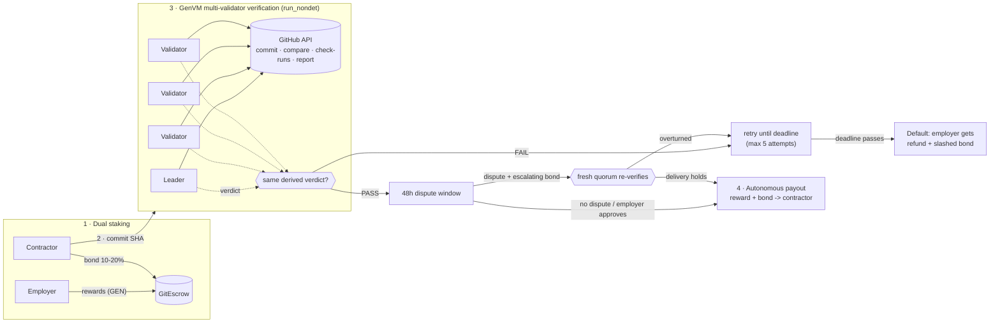

# GitEscrow

**Autonomous, code-verifiable milestone escrow on [GenLayer](https://genlayer.com).**

An employer locks milestone rewards in GEN. A contractor stakes a 10-20% performance bond. When the contractor submits a GitHub commit, a quorum of GenVM validators **independently** inspects it - does the commit exist, is it on the target branch, is CI green, how many tests pass, what is the branch coverage, are there critical findings - and the contract pays out, or doesn't, based on that verdict. No multisig, no arbiter, no "client went silent".

```
contracts/git_escrow.py   the intelligent contract (GenVM, Python)
tests/                    57 direct-mode pytest cases (deposit math, failure modes, slashing, disputes, validator votes)
frontend/                 Next.js + Tailwind dashboard (live against Studio Next)
scripts/                  deploy.py, verify_live.py, simulate_dispute.py
deployments/              recorded Studio Next deployment
```

---

## Architecture



```
 Employer ──reward──┐                                         ┌── PASS ──► 48h window ──► RELEASE
                    ├─► [ GitEscrow ] ◄─commit SHA─ Contractor│                  │ dispute (1x,2x,4x bond)
 Contractor ──bond──┘        │                                │                  ▼
                             ▼                                │          fresh quorum re-check
              ┌─────────────────────────────┐                 │         holds ──► RELEASE (bond -> contractor)
              │ GenVM validators (5)        │─────────────────┤         fails ──► reopen, bond refunded
              │ each fetches GitHub itself  │                 │
              │ leader proposes, rest verify│                 └── FAIL ──► retry … deadline ──► DEFAULT
              └─────────────────────────────┘                                      employer: refund + slashed bond
```

### What validators check (`evaluate_milestone_delivery`)

Every check is a deterministic function of **immutable data bound to the commit SHA**, so independent validators converge on the same answer. No LLM sits in the loop, which means nothing the contractor writes can ever be interpreted as an instruction.

| # | Check | Source | Failure code |
|---|-------|--------|--------------|
| 1 | Commit exists, payload belongs to `owner/repo` | `GET /repos/{repo}/commits/{sha}` (`sha`, `url`, `html_url` must all match) | `commit_not_found`, `spoofed_payload` |
| 2 | Commit is in the target branch's history | `GET /compare/{branch}...{sha}` -> `identical` or `behind` | `commit_not_on_branch` |
| 3 | CI is green for that exact commit | `GET /commits/{sha}/check-runs` | `ci_pending`, `ci_missing`, `ci_failed` |
| 4 | Passing tests >= minimum, zero failing | `raw.githubusercontent.com/{repo}/{sha}/.gitescrow/report.json`, falling back to parsing check-run output (`120 passed`, `0 failed`) | `tests_below_minimum`, `tests_failing` |
| 5 | Branch coverage >= minimum | same report / check-run text | `coverage_below_minimum` |
| 6 | Zero critical lint / vulnerability findings (unknown counts as **not clean**) | `critical_findings` in the report / check-run text | `critical_findings` |

A report whose `commit` or `repository` does not match is flagged `spoofed_payload` and its numbers are discarded. Example report committed at the delivery SHA:

```json
{ "commit": "<40-hex sha>", "repository": "owner/repo",
  "tests_passed": 120, "tests_failed": 0,
  "branch_coverage": 91.5, "critical_findings": 0 }
```

The validator function re-collects the evidence itself and requires the leader's `passed`, `failures`, test count, coverage and CI state to match exactly. A leader that forges a PASS (or inflates one number) is voted down and the round rotates. Errors are classified (`[EXPECTED]`, `[EXTERNAL]`, `[TRANSIENT]`) so rate limits and 5xx never convert into a verdict or a penalty.

### Milestone state machine

```
PENDING ──evaluate: PASS──► VERIFIED ──settle (after 48h) / approve (employer)──► RELEASED
   │  ▲                        │
   │  └──dispute overturned────┤ dispute upheld ──► RELEASED (disputer's bond -> contractor)
   │
   └── deadline passed, claim_default ──► DEFAULTED          (OPEN escrow, employer cancel ──► CANCELLED)
```

### Contract surface

| Method | Who | What |
|---|---|---|
| `create_escrow(contractor, repo, branch, title, bond_bps, milestones_json)` *payable* | employer | deposits `sum(rewards)`; 1-10 milestones, bond 1000-2000 bps |
| `accept_escrow(id)` *payable* | contractor | posts `sum(bonds)`, activates the escrow |
| `cancel_escrow(id)` | employer | refund while the contractor has not bonded |
| `evaluate_milestone_delivery(milestone, sha)` | contractor | **consensus verification**; records the report on-chain |
| `settle_milestone(id)` | anyone | release after the 48h window |
| `approve_milestone(id)` | employer | waive the window, release now |
| `file_dispute(id, reason)` *payable* | employer | escalating bond, fresh quorum re-verification |
| `claim_default(id)` | anyone | after the deadline: refund + slashed bond to the employer |
| `get_escrow`, `get_milestone`, `list_escrows`, `get_stats`, `get_solvency`, `quote_dispute_bond`, `get_strikes` | views | |

---

## Game theory & solvency

Notation: reward `R`, bond `b·R` with `b ∈ [10%, 20%]`, contractor's cost of doing the work `c`.

### Bonding dynamics

| Contractor action | Contractor payoff | Employer payoff |
|---|---|---|
| Delivers valid code in time | `R − c` (bond returned) | the deliverable |
| Ghosts / misses the deadline | `−c_sunk − b·R` | `R + b·R` (full refund **plus** slashed bond) |
| Submits junk repeatedly | nothing; capped at 5 attempts, then default | unaffected |

Delivering is a dominant strategy whenever `R > c`. The bond makes ghosting strictly worse than never signing: the contractor must be willing to lose `b·R` to stall, and the employer is made whole *and* compensated. The bond is also the contractor's credible signal - skin in the game that a fresh wallet otherwise can't offer.

### Slashing conditions

* **Default** - milestone still `PENDING` after its deadline: 100% of that milestone's bond goes to the employer together with the refunded reward. Callable by anyone, so a silent employer cannot be griefed by a keeper-less protocol.
* A **failed verification is not slashing**. A rejected delivery costs only an attempt (max 5); the contractor can fix and resubmit until the deadline. Transient upstream faults (rate limits, 5xx) revert without consuming an attempt.
* **Verified milestones cannot be defaulted**, even after the deadline: the contractor delivered in time.

### Escalating dispute bonds (anti-griefing)

The employer has no discretionary veto - the only way to contest a verified delivery is `file_dispute` inside the 48h window, and it costs:

```
bond = max(0.1 GEN, 1% of reward) × 2^(disputes_on_this_milestone + min(strikes, 4))
```

| Dispute # on a 100 GEN milestone | Bond |
|---|---|
| 1st | 1 GEN |
| 2nd | 2 GEN |
| 3rd | 4 GEN (no 4th: hard cap of 3) |
| 1st, by an address with 1 lost dispute | 2 GEN |
| 1st, by an address with 4+ lost disputes | 16 GEN |

* A dispute is resolved **in the same transaction** by a fresh quorum re-verification of the same commit, so it cannot freeze funds - the worst-case delay is one consensus round, not a time lock.
* **Upheld delivery** (the dispute was frivolous): the bond is forfeited *to the contractor* as compensation and the milestone releases immediately. The disputer earns a strike that raises every future bond for that address.
* **Overturned delivery** (e.g. history force-pushed after verification): the bond is refunded and the milestone returns to `PENDING`; the contractor may resubmit before the deadline.

Because the quorum reads the same immutable evidence both times, a frivolous dispute has expected value `−bond < 0`, and the exponential ladder bounds the total spam any one milestone can absorb to `7×` the base bond.

### Solvency invariant

Every wei is accounted for in exactly one of three buckets, and `get_solvency()` exposes the check on-chain:

```
total_in  ==  total_paid_out  +  liabilities
liabilities = Σ over PENDING/VERIFIED milestones of (reward + bond if the escrow is ACTIVE)
```

| Transition | In | Out | Liabilities |
|---|---|---|---|
| create_escrow | +ΣR | | +ΣR |
| accept_escrow | +Σb·R | | +Σb·R |
| release | | R + b·R | −(R + b·R) |
| claim_default | | R + b·R (employer) | −(R + b·R) |
| cancel_escrow | | ΣR | −ΣR |
| file_dispute (upheld) | +bond | R + b·R + bond | −(R + b·R) |
| file_dispute (overturned) | +bond | bond | 0 |

State is updated *before* any transfer is queued (checks-effects-interactions), and the test-suite asserts the invariant after every settlement path.

### Trust model and known limits (read before using real money)

* **The CI is the root of trust.** Validators faithfully verify what GitHub says about a commit, but if the contractor controls both the code *and* the workflow/report that produces the evidence, they can author a flattering `report.json`. Recommended setup: an **employer-owned repository** with branch protection and a required workflow, where the contractor delivers via PR and the evidence comes from CI the contractor cannot edit. `commit_not_on_branch` then guarantees the delivered commit really is part of that protected history.
* **GitHub API rate limits.** Calls are unauthenticated; a 403/429 is classified `[TRANSIENT]` (the transaction reverts, no attempt consumed) and succeeds on retry or with a different validator.
* **Payout transfers are queued `on="finalized"`** after the accepting transaction, per GenVM semantics.
* The contract has not been audited.

---

## Setup

Requirements: Python ≥ 3.11, Node ≥ 20, [`genvm-lint`](https://pypi.org/project/genvm-lint/), and the GenLayer Python packages.

```bash
python -m venv .venv && source .venv/bin/activate
pip install -r scripts/requirements.txt genvm-lint
```

### Lint and test the contract

```bash
genvm-lint check contracts/git_escrow.py     # lint + SDK validation: 0 errors
pytest                                       # 57 direct-mode tests (in-memory GenVM, ~1.5 min)
```

The suite covers deposit math and the bond lock-up, a passing delivery with parsed test/coverage metrics, every rejection path (too few tests, failing tests, low coverage, critical findings, missing commit, off-branch commit, CI red/pending/missing, expired deadline, spoofed report, spoofed repository payload), default + slashing, the escalating dispute ladder and strikes, and validator agreement/disagreement against swapped GitHub mocks (`direct_vm.run_validator`).

### Adversarial simulation (no network, no keys)

```bash
python scripts/simulate_dispute.py
```

A contractor throws a ghost commit, a spoofed report, a repository swap, an off-branch commit and cherry-picked metrics at the escrow; every one is rejected. Then an honest validator votes `DISAGREE` against a leader that forged a PASS, and a ghosting contractor is slashed.

### Dashboard

```bash
cd frontend
npm install
npm run dev            # http://localhost:3000
npm test               # TypeScript copy of the bond / dispute rules, pinned to the Python numbers
```

The dashboard is live-only: it reads and writes the contract deployed on Studio Next (`0xF461Aef48b527D020715B18966f03c4ABE75Da11`, set in `frontend/lib/config.ts`) through `genlayer-js`, signing with a browser-held test key (the `Fund` button uses the Studio faucet RPC). If you redeploy, update `CONTRACT_ADDRESS` in `config.ts`.

Panels: escrow explorer + creator (repo, branch, milestones, thresholds, bond slider, deadline pickers), TVL / dual-staking / solvency strip, milestone progress bar and submission card, live consensus telemetry (per-check results, validator votes), and the dispute & settlement terminal (countdown, claim settlement, default claim, escalating bond ladder).

### Deploy to GenLayer Studio Next

```bash
python scripts/deploy.py                    # deploy, seed two demo escrows, export artifacts
python scripts/verify_live.py               # deposit -> bond -> commit -> consensus -> default & slash
python scripts/verify_live.py --repo OWNER/REPO --sha FULL_SHA   # ... -> verified -> release
```

`deploy.py` writes `deployments/studio-next.json` and `frontend/lib/gitescrow.generated.json` (address + ABI). Test keys are generated into `deployments/.keys/` (git-ignored) and funded from the Studio faucet; override with `GITESCROW_EMPLOYER_KEY` / `GITESCROW_CONTRACTOR_KEY`.
