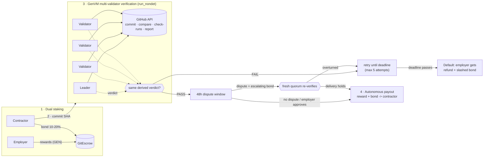

# GitEscrow

**Autonomous, code-verifiable milestone escrow on [GenLayer](https://genlayer.com).**

An employer locks milestone rewards in GEN. A contractor stakes a 10-20% performance bond. When the contractor submits a GitHub commit, a quorum of GenVM validators **independently** inspects it - does the commit exist, is it on the target branch, is CI green, how many tests pass, what is the branch coverage, are there critical findings - and the contract pays out, or doesn't, based on that verdict. No multisig, no arbiter, no "client went silent".

```
contracts/git_escrow.py   the intelligent contract (GenVM, Python)
tests/                    direct-mode pytest cases (deposit math, attested CI, delivery refs, dispute invariance, external faults, no-deadlock paths, validator votes)
frontend/                 Next.js + Tailwind dashboard (live against Studio Next)
scripts/                  deploy.py, verify_live.py, simulate_dispute.py
deployments/              recorded Studio Next deployment
```

---

## Architecture



```
 Employer ──reward──┐                                         ┌── PASS ──► 48h window ──► RELEASE
                    ├─► [ GitEscrow ] ◄─commit SHA─ Contractor│                  │ dispute (1x,2x,4x bond)
 Contractor ──bond──┘        │                                │                  ▼
                             ▼                                │          fresh quorum re-check
              ┌─────────────────────────────┐                 │         holds ──► RELEASE (bond -> contractor)
              │ GenVM validators (5)        │─────────────────┤         fails ──► reopen, bond refunded
              │ each fetches GitHub itself  │                 │
              │ leader proposes, rest verify│                 └── FAIL ──► retry … deadline ──► DEFAULT
              └─────────────────────────────┘                                      employer: refund + slashed bond
```

### What validators check (`evaluate_milestone_delivery`)

Every check is a deterministic function of **immutable data bound to the commit SHA** plus the live availability of the repository, so independent validators converge on the same answer. No LLM sits in the loop, which means nothing the contractor writes can ever be interpreted as an instruction.

The repository is bound by its **numeric GitHub id** when the contractor accepts (a consensus round resolves `owner/repo` to an id, following 301 redirects). Every later call goes through `/repositories/{id}`, so a rename or transfer never breaks evaluation.

| # | Check | Source | Failure code |
|---|-------|--------|--------------|
| 0 | Repository reachable (not deleted, private or blocked) | `GET /repositories/{id}` | `repo_unavailable` -> **frozen**, never slashed |
| 1 | Commit exists, payload belongs to this repository | `GET /repositories/{id}/commits/{sha}` (`sha`, `url`, `html_url` must match the repository's current `full_name`) | `commit_not_found`, `spoofed_payload` |
| 2 | Commit is in the **delivery ref** (see below) | `delivery_ref` = `""` target branch -> `compare/{branch}...{sha}`; `pull/N` -> `GET /pulls/N` (head SHA must equal the commit, base must be the agreed branch); any other branch -> `compare/{ref}...{sha}` | `commit_not_on_ref` |
| 3 | **Attested CI**: the check-run with the milestone's exact `check_name`, created by the exact `app_id` (default `15368` = GitHub Actions), completed with `success`; newest re-run wins | `GET .../commits/{sha}/check-runs` | `ci_attestation_missing`, `ci_pending`, `ci_failed` |
| 4 | Passing tests >= minimum, zero failing | parsed from **that check-run's output** (`120 passed`, `0 failed`) | `tests_below_minimum`, `tests_failing` |
| 5 | Branch coverage >= minimum | same check-run output (`Branch coverage: 91.5%`) | `coverage_below_minimum` |
| 6 | Zero critical lint / vulnerability findings (unknown counts as **not clean**) | same check-run output (`Critical issues: 0`) | `critical_findings` |
| 7 | Optional `.gitescrow/report.json` must **strictly match** the check-run | `raw.githubusercontent.com/{repo}/{sha}/.gitescrow/report.json` | `SPOOFED_REPORT_PAYLOAD` |

**Delivery refs - no merge veto.** `evaluate_milestone_delivery(milestone, sha, delivery_ref)` takes the place the commit lives. The default `""` is the agreed target branch. `pull/N` verifies the commit as the **head of pull request N**, which must target the agreed branch, so an *unmerged* PR whose attested check-run is green is a valid delivery: the employer cannot veto payment by declining to merge, closing the PR, or rewriting `main`. A contractor may also name any other branch of the repository. The ref only has to *contain* the commit; trust comes from the attested check-run bound to that SHA.

**Disputes judge the delivered SHA, not the branch.** When a delivery is disputed, validators re-check only: the commit still exists and belongs to the repository, and the **pinned check-run** (the exact run id recorded at submission) still verifies with the same thresholds. Ref containment is deliberately *not* re-evaluated, and re-runs of the check (new run ids) are ignored. An employer who force-pushes, resets or deletes the branch after delivery, closes the PR, or re-triggers CI therefore cannot overturn a valid delivery. A dispute can only succeed if the evidence the delivery was accepted on has actually changed (the pinned run now reports failure, the run or the commit is gone).

A contractor-committed `report.json` can **never** substitute for, or improve on, the CI evidence: if it is present it may only corroborate. Any claimed metric (tests, failures, coverage, critical findings) that differs from the check-run, a missing check-run behind a populated report, or a report naming another commit or repository fails the delivery with `SPOOFED_REPORT_PAYLOAD`. Check-runs from other apps or with other names are ignored entirely. Example of the attested check-run summary the parser reads:

```
120 passed, 0 failed. Branch coverage: 91.5%. Critical issues: 0
```

> **Workflow requirement: publish results through the Checks API.** A stock GitHub Actions job conclusion (`success`/`failure`) is not enough: validators parse the check-run's `output.title` / `output.summary` / `output.text`. Your workflow must therefore publish its test, coverage and security numbers there, either with a step that calls the Checks API (`POST /repos/{repo}/check-runs` or `PATCH /repos/{repo}/check-runs/{id}` with `output: { title, summary }`), or with an action that writes a test summary into the check-run output in the format above (`N passed`, `N failed`, `Branch coverage: X%`, `Critical issues: N`). The check-run's **name** must equal the milestone's `check_name` and it must be created by the milestone's `app_id` (`15368` for the built-in `GITHUB_TOKEN` / GitHub Actions). A job that only writes to the step summary (`$GITHUB_STEP_SUMMARY`) or uploads an artifact is invisible to the validators and will fail with `ci_attestation_missing` or `tests_below_minimum`.

The validator function re-collects the evidence itself and requires the leader's `passed`, `failures`, repository availability, test count, coverage, CI state and report-mismatch flag to match exactly. A leader that forges a PASS, inflates one number, hides a report mismatch or fakes a repository outage is voted down and the round rotates. Errors are classified (`[EXPECTED]`, `[EXTERNAL]`, `[TRANSIENT]`) so rate limits, 5xx and unresolved 301s never convert into a verdict or a penalty.

**Attempt conservation.** A delivery attempt is consumed only by a real verdict. Transient faults revert (nothing consumed). A verdict that is purely `ci_pending` costs a free *CI poll* (up to 20 per milestone, then it counts). An unreachable repository freezes the milestone and costs nothing.

### Milestone state machine

```
PENDING ──evaluate(sha, delivery_ref): PASS──► VERIFIED ──settle (after 48h) / approve (employer)──► RELEASED
   │  ▲                                          │
   │  └─ dispute OVERTURNED (pinned evidence     │  dispute UPHELD (the delivered SHA + pinned check-run
   │     changed): deadline := max(deadline,     │  still verify, whatever happened to the branch)
   │     now + 72h), attempts reset              └──► RELEASED (disputer's bond -> contractor)
   │
   ├── deadline + resubmit grace passed, repo reachable, claim_default ──► DEFAULTED (refund + slashed bond)
   │
   └── repo deleted / private / blocked (claim_default or evaluate) ──► FROZEN_EXTERNAL_FAULT
            ├─ thaw_milestone (anyone) or evaluate, once the repo answers
            │     ──► PENDING: deadline >= now + 72h, at least ONE fresh attempt (attempts <= 4)
            └─ cancel_fault_free ──► CANCELLED_FAULT_FREE (employer refunded, bond returned intact)
                  * both parties consent, or
                  * after 7 days: repo still unreachable, OR attempts exhausted, OR deadline elapsed

(OPEN escrow, employer cancel ──► CANCELLED)
```

**No milestone can be deadlocked.** Every non-terminal state has a path that does not depend on the counterparty: `OPEN` -> employer `cancel_escrow`; `PENDING` -> delivery, or `claim_default` after the deadline; `VERIFIED` -> `settle_milestone` after 48h (no repo access needed); `FROZEN` -> `thaw_milestone` / `evaluate`, or after the 7-day cooldown a unilateral `cancel_fault_free` (the cancel is refused only while the repo is reachable *and* the contractor still has attempts *and* time left, in which case thaw/resubmit is the path). A frozen milestone whose attempts are spent can always be thawed (a fresh attempt is granted) or cancelled. Funds therefore always end in one of: contractor payout, employer refund + slash, or a fault-free refund.

### Contract surface

| Method | Who | What |
|---|---|---|
| `create_escrow(contractor, repo, branch, title, bond_bps, milestones_json)` *payable* | employer | deposits `sum(rewards)`; 1-10 milestones, bond 1000-2000 bps |
| `accept_escrow(id)` *payable* | contractor | posts `sum(bonds)`; a consensus round binds the repository's numeric id |
| `cancel_escrow(id)` | employer | refund while the contractor has not bonded |
| `evaluate_milestone_delivery(milestone, sha, delivery_ref)` | contractor | **consensus verification** of the commit on the target branch / a branch / `pull/N`; records the report and pins the check-run |
| `settle_milestone(id)` | anyone | release after the 48h window |
| `approve_milestone(id)` | employer | waive the window, release now |
| `file_dispute(id, reason)` *payable* | employer | escalating bond + non-refundable 3% fee; fresh quorum re-verification; overturn grants a 72h resubmit window |
| `claim_default(id)` | anyone | after deadline **and** resubmit grace: probes the repo, then refund + slashed bond to the employer (or freezes if the repo is unreachable) |
| `thaw_milestone(id)` | anyone | revive a frozen milestone once the repo answers (fresh 72h window, >= 1 fresh attempt) |
| `cancel_fault_free(id)` | employer / contractor | neutral exit for a frozen milestone: employer refunded, bond returned intact |
| `get_escrow`, `get_milestone`, `list_escrows`, `get_stats`, `get_solvency`, `quote_dispute_bond`, `quote_dispute_fee`, `get_strikes` | views | |

---

## Game theory & solvency

Notation: reward `R`, bond `b·R` with `b ∈ [10%, 20%]`, contractor's cost of doing the work `c`. The bonding table and the repository-trust analysis are in *Game Theory, Repo Trust Trilemma & Known Limitations* below.

### Slashing conditions

* **Default** - milestone still `PENDING` after its deadline *and* any resubmit grace window, **and** a consensus probe confirms the repository is reachable: 100% of that milestone's bond goes to the employer together with the refunded reward. Callable by anyone.
* A **failed verification is not slashing**. A rejected delivery costs only an attempt (max 5); the contractor can fix and resubmit until the deadline.
* **Verified milestones cannot be defaulted**, even after the deadline: the contractor delivered in time.
* **External faults are never slashing.** A deleted, private or blocked repository freezes the milestone instead (see below).

### Escalating dispute bonds and the non-refundable fee (anti-griefing)

The employer has no discretionary veto - the only way to contest a verified delivery is `file_dispute` inside the 48h window, and it costs two things:

```
bond = max(0.1 GEN, 1% of reward) × 2^(disputes_on_this_milestone + min(strikes, 4))   (refundable if the delivery is overturned)
fee  = max(0.02 GEN, 3% of reward)                                                       (never refunded; held by the contract for good)
```

| Dispute # on a 100 GEN milestone | Bond | Fee | Total paid |
|---|---|---|---|
| 1st | 1 GEN | 3 GEN | 4 GEN |
| 2nd | 2 GEN | 3 GEN | 5 GEN |
| 3rd | 4 GEN (no 4th: hard cap of 3) | 3 GEN | 7 GEN |
| 1st, by an address with 1 lost dispute | 2 GEN | 3 GEN | 5 GEN |
| 1st, by an address with 4+ lost disputes | 16 GEN | 3 GEN | 19 GEN |

* A dispute is resolved **in the same transaction** by a fresh quorum re-verification of the same commit, so it cannot freeze funds - the worst-case delay is one consensus round, not a time lock.
* **Upheld delivery** (the dispute was frivolous): the bond is forfeited *to the contractor* as compensation, the fee is retained, and the milestone releases immediately. The disputer earns a strike that raises every future bond for that address.
* **Overturned delivery** (e.g. history force-pushed after verification): the bond is refunded, the **fee is not**, and the milestone returns to `PENDING` with `deadline = max(deadline, now + 72h)` and a fresh attempt budget. `claim_default` is blocked until that window has passed, so an employer cannot disprove a delivery after the deadline and then slash the bond before the contractor can react.
* A dispute **cannot be decided** while the repository is unreachable or the pinned check-run is `pending` - the employer cannot win by deleting the repo or re-triggering CI. It also **cannot be won by rewriting the branch**: validators judge the delivered SHA and its pinned check-run, not the branch tip.

The fee makes a zero-cost harassment dispute impossible: every dispute burns at least 3% of the milestone regardless of outcome, the bond ladder bounds spam on one milestone, and strikes raise the price for repeat offenders.

### Solvency invariant

Every wei is accounted for in exactly one of three buckets, and `get_solvency()` exposes the check on-chain:

```
total_in  ==  total_paid_out  +  liabilities  +  fees_retained
liabilities = Σ over PENDING / VERIFIED / FROZEN milestones of (reward + bond if the escrow is ACTIVE)
```

| Transition | In | Out | Liabilities |
|---|---|---|---|
| create_escrow | +ΣR | | +ΣR |
| accept_escrow | +Σb·R | | +Σb·R |
| release | | R + b·R | −(R + b·R) |
| claim_default | | R + b·R (employer) | −(R + b·R) |
| cancel_escrow | | ΣR | −ΣR |
| cancel_fault_free | | R (employer) + b·R (contractor) | −(R + b·R) |
| file_dispute (upheld) | +bond +fee | R + b·R + bond | −(R + b·R), fees +fee |
| file_dispute (overturned) | +bond +fee | bond | fees +fee |

State is updated *before* any transfer is queued (checks-effects-interactions), and the test-suite asserts the invariant after every settlement path.

## Game Theory, Repo Trust Trilemma & Known Limitations

### The Repository Trilemma

Someone must control the repository, and whoever does can influence the evidence. The three options trade off differently:

| Repository owner | Failure mode | What GitEscrow does about it |
|---|---|---|
| **Employer-owned** (contractor delivers via PR) | The employer controls `main`, the branch protections and, unless pinned, the workflow files. They can refuse to merge, close the PR, force-push, delete the repo, make it private, or edit CI configuration | **Delivery is verified at the commit level, on the delivery ref.** A PR head (`pull/N`) with a green attested check-run is a valid delivery whether or not it is ever merged, so refusing to merge cannot block payment. Branch rewrites after delivery are ignored by disputes (the SHA and its pinned check-run are what is judged). Repo deletion / privatisation freezes the milestone instead of defaulting it, and ends in a fault-free refund out (employer refunded, bond returned). **Residual risk, disclosed:** if the employer also controls the branch *and the CI configuration* (workflow files on the base branch, required-workflow settings, the app that publishes the check-run), they can make the attested check fail for a genuinely good commit before delivery is evaluated. Protection then rests only on commit-level SHA verification plus the fault-free refund exit: the contractor is never slashed for it (an unreachable repo freezes; a failing check just burns an attempt), but can be denied *payment*. Mitigate by pinning the CI workflow in the agreed commit, using a neutral GitHub App `app_id`, or a neutral org. |
| **Contractor-owned** | The contractor controls code, workflow and report, so they can forge the evidence, or delete the repo to dodge a slash | Evidence is bound to a **named check-run from a pinned GitHub App id**; a committed `report.json` can only corroborate it (any mismatch is `SPOOFED_REPORT_PAYLOAD`). Deletion yields the same neutral freeze, so it earns the contractor a free exit, never the employer's money. |
| **Neutral third party** (org both sides trust) | Needs a third party; fully removes the incentive to tamper | Recommended whenever the stakes justify it. |

GitEscrow therefore does not claim to remove the need for repo trust. It removes the **profitable** abuses: a party that destroys the evidence cannot slash the other side, a party that refuses to merge cannot block a verified delivery, and a party that fabricates evidence cannot beat an attested check-run. The unavoidable residual risk is whoever controls the CI that publishes the check-run: a contractor-owned repo lets the contractor make that workflow print flattering numbers; an employer-owned repo lets the employer make it fail. Neither side can steal the other's *funds* through it (worst cases: a free fault-free exit, or an unpaid-but-unslashed contractor), but pick the owner, or a neutral GitHub App, accordingly.

**Neutral fault-free cancellation.** Deleting, privatising or blocking the repository (404/410/451, a non-rate-limit 403, or a `private` repo) freezes the milestone. Anyone can `thaw_milestone` once the repo answers, or the contractor can simply resubmit: the deadline is extended to at least `now + 72h` and at least one attempt is restored, so a frozen milestone never lands in a state where every call reverts. Otherwise either party may `cancel_fault_free`: immediately if both consent, or after a 7-day cooldown if a fresh quorum round still finds the repo unreachable, **or** the attempts are exhausted, **or** the deadline has elapsed. The employer's deposit is refunded and the contractor's bond is returned 100% intact; nobody is slashed and nobody is paid.

### Bonding dynamics and slashing

| Contractor action | Contractor payoff | Employer payoff |
|---|---|---|
| Delivers valid code in time | `R − c` (bond returned) | the deliverable |
| Ghosts / misses the deadline (repo reachable) | `−c_sunk − b·R` | `R + b·R` (full refund **plus** slashed bond) |
| Submits junk repeatedly | nothing; capped at 5 attempts, then default | unaffected |
| Deletes the repo to dodge the slash | bond returned, no reward (neutral exit) | deposit refunded, no deliverable |

Delivering is a dominant strategy whenever `R > c`: ghosting costs the bond, and the neutral-exit route only returns the contractor to where they started. The documented weakness is exactly that last row - on a contractor-owned repo a bad-faith contractor can buy a free exit by deleting it. If that matters, own the repo on the employer side or use a neutral org.

### Mutable off-chain state and timing attacks

Branch heads, check-run states and repository visibility are **mutable off-chain**: a branch can be force-pushed after verification, a check-run can be re-run, a repo can disappear. The defences are structural rather than clock-based:

* **72-hour dispute-resubmit window.** If a dispute overturns a delivery, `deadline = max(deadline, now + 72h)` and attempts reset, and `claim_default` stays blocked until the new deadline passes. An employer who waits for the original deadline to expire, force-pushes, disputes, and then tries to harvest the bond gets nothing: the contractor has three full days to resubmit.
* **Non-refundable arbitration fee** (3%, floor 0.02 GEN) on every dispute, on top of the escalating refundable bond. A dispute that is cheap to file is a free option on the contractor's money; with the fee it is a guaranteed loss unless the delivery was genuinely invalidated.
* **Re-run and rewrite attacks.** Disputes are pinned to the check-run recorded at delivery, so re-running CI (a new run id) does nothing; they never re-evaluate the branch, so force-pushing, resetting or deleting it does nothing; and they are refused while the pinned run is `pending` or the repository is unreachable. The only way to overturn is for the *pinned evidence itself* to change (the app updates that run to a failure, or the run or commit disappears), in which case the contractor gets the 72h resubmit window.
* **Branch tip is irrelevant after delivery.** Ref containment is checked once, at submission. After that the delivery stands on its SHA.

### Commit Baseline & Author Binding Limitation

Milestone evaluation answers one question: *does this commit exist in the agreed delivery ref (target branch, a branch, or the head of `pull/N`) and does the pinned check-run for that exact SHA report passing results above the milestone's thresholds?* It does **not**:

* **attest the Git author.** There is no check that the commit was written, signed or pushed by the contractor (no GPG/SSH signature verification, no author or committer matching). Anyone can submit any SHA, and the contract treats a green commit as a green commit.
* **diff against a baseline.** It does not compare the commit with the repository's state at escrow creation, so it cannot tell *new* work from work that already existed.

Consequently an **already-existing green commit**, or the head of a **third-party pull request** that happens to satisfy the thresholds, can satisfy a milestone that was never actually worked on. GitEscrow cannot detect this on-chain; the employer must close the gap when creating the milestone:

* **Calibrate thresholds above the current baseline.** Set `min_tests` and `min_coverage_bps` to realistic *incremental* values: strictly more passing tests, and strictly higher branch coverage, than the repository has today. A milestone whose bar is already cleared by `main` is paid out on day one.
* **Or pin an explicit `expected_sha`.** A non-empty `expected_sha` makes the contract accept exactly that commit and nothing else. This is the strongest guard, but it means agreeing on the delivery commit up front (for example a SHA the employer has reviewed and tagged), so use it for fixed, reviewable deliverables.
* Prefer an `app_id`/`check_name` pair the contractor cannot satisfy with someone else's code (see below) and review the PR before bonding.

### Check-Run Persistence & Workflow Control

* **Check-runs must stay on the GitHub Checks API.** Validators read the check-run's `output` at verification time and again, pinned by run id, if the delivery is disputed. If a check-run is deleted or its app is uninstalled, a re-check finds no pinned run and reports `ci_attestation_missing`, which is the one thing that can overturn an already verified delivery. Keep the CI app installed and do not prune check-runs for delivered SHAs until the milestone is `RELEASED`.
* **Why an employer-owned repo with a pinned `check_name` matters.** The attested check-run is only as trustworthy as whoever controls the workflow that produces it. In a contractor-owned repo the contractor writes the workflow and can make it print any numbers under the right name. In an employer-owned repo, the employer fixes the workflow and the exact `check_name` / `app_id` in the milestone, so a contractor PR cannot invent a check-run that validators will accept: check-runs from other names or other apps are ignored outright, and a committed `report.json` can only corroborate the real one.
* **Caveat: the workflow file itself must be protected.** For the plain `pull_request` trigger, GitHub runs the workflow definition from the PR's own merge commit, so a contractor PR can edit the workflow that reports its own results. Close that hole on the employer's side with repository **rulesets / required workflows** (the workflow comes from the base branch), a `pull_request_target` or `workflow_run` design that never executes PR-supplied workflow definitions, or a dedicated GitHub App `app_id` that publishes the check-run from outside the repository. GitEscrow cannot verify this configuration on-chain; it only guarantees that nothing but the named check-run from the named app counts.

### Public Recovery (`thaw_milestone`)

`thaw_milestone` is deliberately **permissionless**: anyone (employer, contractor, a third-party keeper or a bot) can call it. Its only effect is to move a `FROZEN_EXTERNAL_FAULT` milestone back to `PENDING` once a validator quorum confirms the repository is reachable again, granting a fresh 72h window and at least one fresh attempt. It never moves funds, never slashes, and reverts unless the milestone is frozen *and* the repo currently answers, so it cannot be used to grief either side. This exists so that an outage which resolves itself cannot leave a milestone stranded waiting for a specific party to notice: the recovery needs no cooperation from the contractor or the employer. If nobody thaws it, the 7-day `cancel_fault_free` exit still guarantees a terminal outcome.

### GitHub API rate limits near close deadlines

Validators call the unauthenticated GitHub API (60 requests/hour/IP). A rate-limit 403 (header or body says so), 429, 5xx or unresolved 301 is classified `[TRANSIENT]`: the transaction reverts, **no attempt is consumed, and the contractor is never slashed for it**. But `claim_default`, `cancel_fault_free` and `accept_escrow` also need a successful probe, so an outage or rate-limit burst just delays them. Contractors should submit well before a deadline rather than in the last minutes, because a delivery that cannot be verified in time cannot be defended on-chain (the 72h window only starts after an overturned dispute).

### Other limits

* **Payout transfers are queued `on="finalized"`** after the accepting transaction, per GenVM semantics.
* Dispute fees are held by the contract with no withdrawal path (equivalent to burning); `get_stats().fees_retained` reports the total.
* The contract has not been audited.

---

## Setup

Requirements: Python ≥ 3.11, Node ≥ 20, [`genvm-lint`](https://pypi.org/project/genvm-lint/), and the GenLayer Python packages.

```bash
python -m venv .venv && source .venv/bin/activate
pip install -r scripts/requirements.txt genvm-lint
```

### Lint and test the contract

```bash
genvm-lint check contracts/git_escrow.py     # lint + SDK validation: 0 errors
pytest                                       # direct-mode tests (in-memory GenVM, ~3 min)
```

The suite covers deposit math and the bond lock-up, a passing delivery with parsed test/coverage metrics, every rejection path (too few tests, failing tests, low coverage, critical findings, missing commit, off-branch commit, CI red/pending/missing, expired deadline, spoofed report, spoofed repository payload), default + slashing, the escalating dispute ladder and strikes, and validator agreement/disagreement against swapped GitHub mocks (`direct_vm.run_validator`).

### Adversarial simulation (no network, no keys)

```bash
python scripts/simulate_dispute.py
```

A contractor throws a ghost commit, a spoofed report, a repository swap, an off-branch commit and cherry-picked metrics at the escrow; every one is rejected. Then an honest validator votes `DISAGREE` against a leader that forged a PASS, and a ghosting contractor is slashed.

### Dashboard

```bash
cd frontend
npm install
npm run dev            # http://localhost:3000
npm test               # TypeScript copy of the bond / dispute rules, pinned to the Python numbers
```

The dashboard is live-only: it reads and writes the contract deployed on Studio Next (address in `frontend/lib/config.ts`) through `genlayer-js`, signing with a browser-held test key (the `Fund` button uses the Studio faucet RPC). `scripts/deploy.py` keeps `CONTRACT_ADDRESS` in sync.

Panels: escrow explorer + creator (repo, branch, milestones, thresholds, bond slider, deadline pickers), TVL / dual-staking / solvency strip, milestone progress bar and submission card, live consensus telemetry (per-check results, validator votes), and the dispute & settlement terminal (countdown, claim settlement, default claim, escalating bond ladder).

### Deploy to GenLayer Studio Next

```bash
python -m scripts.deploy                    # deploy, seed two demo escrows, export artifacts
python scripts/verify_live.py               # deposit -> bond -> commit -> consensus -> default & slash
python scripts/verify_live.py --repo OWNER/REPO --sha FULL_SHA   # ... -> verified -> release
```

`deploy.py` writes `deployments/studio-next.json`, `frontend/lib/gitescrow.generated.json` (address + ABI) and updates `CONTRACT_ADDRESS` in `frontend/lib/config.ts`, which drives the dashboard and footer links. Test keys are generated into `deployments/.keys/` (git-ignored) and funded from the Studio faucet; override with `GITESCROW_EMPLOYER_KEY` / `GITESCROW_CONTRACTOR_KEY`.
